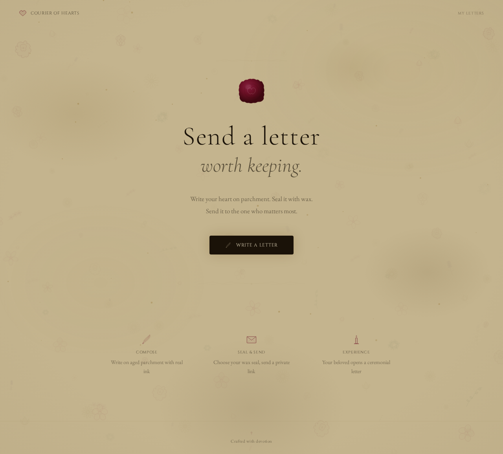
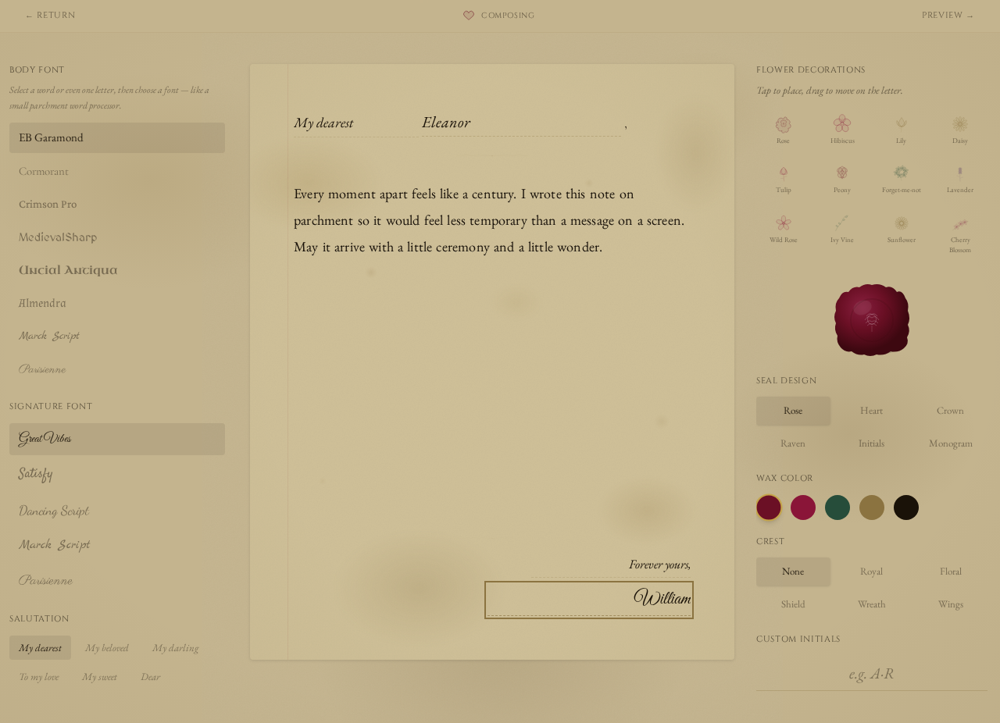

# The Courier of Hearts

> *Send a letter worth keeping.*

A beautiful web application for writing and sending medieval-style letters. Write your heart on parchment, seal it with wax, and send a private link to the one who matters most.

When your recipient opens the link, they experience an immersive, ceremonial letter-opening sequence — complete with wax seal breaking, envelope unfolding, and ink fading into view.

**This is not a notes app. This is a love letter, delivered with craftsmanship.**

---

## Screenshots

### Landing


### Compose


### Delivery Ceremony


---

## Features

- **Beautiful Letter Composition** — Write on realistic parchment with a quill-inspired editor
- **Wax Seal Customization** — Choose from 6 seal designs and 5 wax colors
- **Crest Selection** — Royal, floral, shield, wreath, and wings crests
- **Ceremonial Delivery** — Recipients experience an animated envelope-opening ceremony
- **Password Protection** — Seal your letters with a secret passphrase
- **Print as Royal Letter** — Frame-worthy print layout with decorative borders
- **Shareable Links** — Generate unique URLs for each letter
- **Ambient Effects** — Floating dust particles, candle glow, parchment textures
- **Mobile-First** — Beautiful experience on every device
- **Accessible** — Respects reduced motion, screen readers, keyboard navigation

---

## Tech Stack

- **React 19** with TypeScript
- **Vite** for build tooling
- **Tailwind CSS 4** for styling
- **vite-plugin-singlefile** for single-file deployment
- **localStorage** for demo storage (designed for easy backend swap)

---

## Local Setup

```bash
# Clone the repository
git clone https://github.com/your-username/courier-of-hearts.git
cd courier-of-hearts

# Install dependencies
npm install

# Start frontend development server
npm run dev

# In another terminal, start the backend API
npm run server

# Build for production
npm run build

# Preview production build
npm run preview
```

---

## Architecture

```
src/
├── App.tsx                    # Root component with routing
├── hooks/
│   └── useRouter.ts           # Hash-based routing
├── services/
│   └── api.ts                 # Service layer (localStorage today, REST tomorrow)
├── types/
│   └── letter.ts              # TypeScript models
├── components/
│   ├── icons/
│   │   ├── SvgIcons.tsx       # Hand-illustrated SVG icons
│   │   └── WaxSealIcon.tsx    # Customizable wax seal component
│   ├── effects/
│   │   ├── DustParticles.tsx  # Floating particle effect
│   │   └── CandleGlow.tsx     # Ambient candle lighting
│   ├── letter/
│   │   ├── LetterPreview.tsx  # Letter display with ornaments
│   │   └── CrestDecoration.tsx # Heraldic crest SVGs
│   └── pages/
│       ├── LandingPage.tsx    # Hero and feature highlights
│       ├── ComposePage.tsx    # Letter writing experience
│       ├── DeliveryPage.tsx   # Ceremonial letter opening
│       ├── LetterSentPage.tsx # Share link after sending
│       └── MyLettersPage.tsx  # Letter management
```

### Backend API

This repository now includes a Fastify backend that implements the API described in [`API.md`](API.md).

```bash
# Start the API on http://localhost:3001
npm run server

# Optional development mode with Node's file watcher
npm run dev:server
```

Useful environment variables:

| Variable | Default | Description |
| --- | --- | --- |
| `PORT` | `3001` | API server port |
| `HOST` | `0.0.0.0` | API bind host |
| `JWT_SECRET` | development fallback | Secret used to sign management tokens |
| `JWT_EXPIRES_IN` | `365d` | Management token lifetime |
| `DATA_FILE` | `server/data/letters.json` | JSON persistence file |
| `CORS_ORIGIN` | `true` | CORS origin setting |
| `VITE_API_BASE_URL` | `http://localhost:3001/api/v1` | Frontend API base URL |

The backend stores letters in a local JSON file for easy development, hashes private-letter passphrases with bcrypt, and issues JWT management tokens on letter creation. The frontend stores only those per-letter management tokens in `localStorage` so the existing **My Letters**, update, and delete flows can work without user accounts.

### Service Layer

All data access goes through `services/api.ts`. Components never touch storage directly. The service now calls the REST API, remembers returned management tokens client-side, and attaches `Authorization: Bearer <token>` for management operations.

---

## Future API Design

### Endpoints

| Method | Path | Description |
|--------|------|-------------|
| POST | `/api/v1/letters` | Create a new letter |
| GET | `/api/v1/letters/:slug` | Retrieve a letter |
| PUT | `/api/v1/letters/:slug` | Update a letter |
| DELETE | `/api/v1/letters/:slug` | Delete a letter |
| POST | `/api/v1/letters/:slug/unlock` | Unlock a password-protected letter |
| POST | `/api/v1/letters/:slug/view` | Record a view |
| GET | `/api/v1/seals` | List available seal designs |
| GET | `/api/v1/crests` | List available crests |
| GET | `/api/v1/health` | Health check |

### Future Stack

- **Backend:** Node.js + Fastify
- **Database:** PostgreSQL + Prisma
- **Storage:** S3-compatible for assets
- **Caching:** Redis
- **Auth:** JWT tokens for letter authors

### Full API Documentation

See **[API.md](API.md)** for the complete specification including:
- Request/response examples for every endpoint
- Validation rules and constraints
- Error codes and rate limiting
- Database schema with all fields
- Security considerations
- Deployment architecture

---

## Deployment

### Static Hosting / GitHub Pages

The build produces a single `dist/index.html` file plus copied public assets such as the favicon. Deploy to any static host:

- **Vercel:** `npx vercel --prod`
- **Netlify:** Drag and drop `dist/` folder
- **GitHub Pages:** this repo includes `.github/workflows/pages.yml`
- **Any web server:** Serve `dist/index.html`

To enable GitHub Pages:

1. Push the repository to GitHub.
2. In **Settings → Pages**, choose **GitHub Actions** as the source.
3. Push to `main` or `master`, or run the workflow manually.
4. Optional but recommended: set repository variable `VITE_API_BASE_URL` to your deployed backend URL, e.g. `https://api.example.com/api/v1`.

Note: GitHub Pages hosts only the static frontend. The Fastify backend must run separately if you want shareable letters to work across devices.

### Docker (Future)

```dockerfile
FROM node:20-alpine AS build
WORKDIR /app
COPY package*.json ./
RUN npm ci
COPY . .
RUN npm run build

FROM nginx:alpine
COPY --from=build /app/dist /usr/share/nginx/html
EXPOSE 80
```

---

## Contributing

See [CONTRIBUTING.md](CONTRIBUTING.md) for guidelines.

---

## License

MIT — See [LICENSE](LICENSE) for details.

---

## Philosophy

This project exists to help people express affection, gratitude, romance, and heartfelt emotion through beautiful digital letters.

Every design decision optimizes for **emotional impact** rather than feature count.

When choosing between more features or more beauty — choose beauty.

When choosing between more settings or a smoother experience — choose the smoother experience.

The goal is to create something people remember years later.

---

*Crafted with devotion.*
