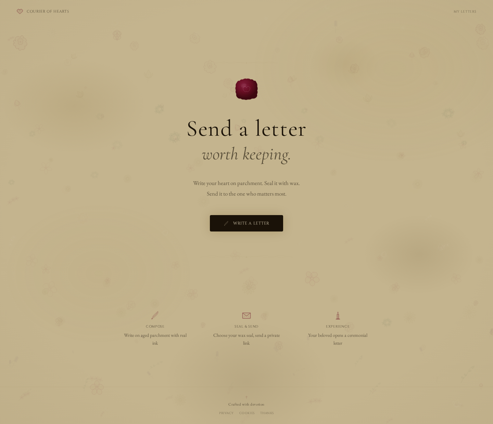
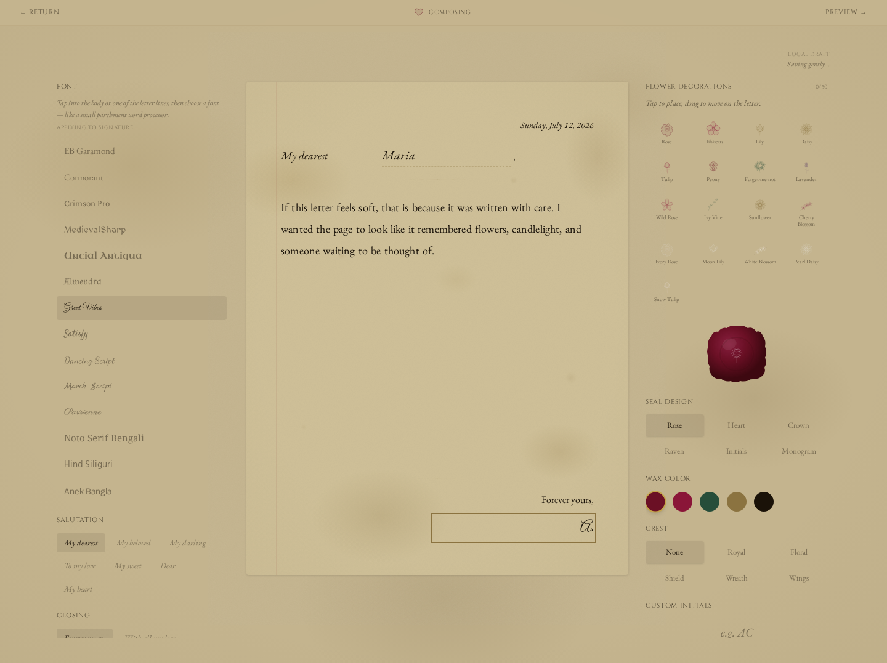
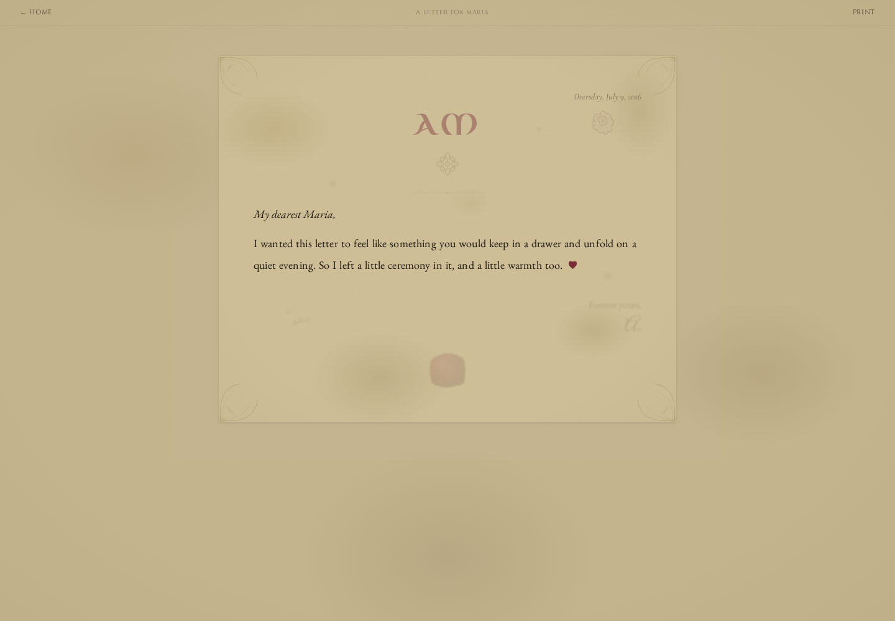
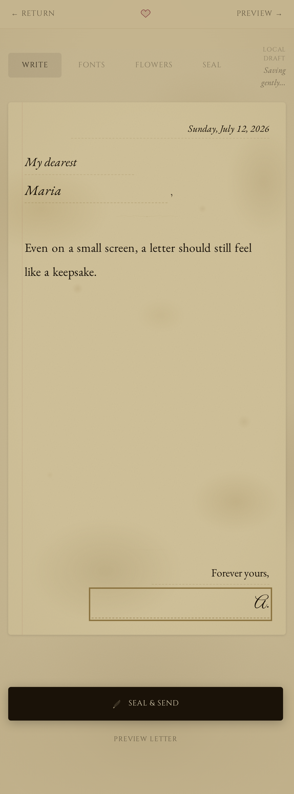

# The Courier of Hearts

> *Send a letter worth keeping.*

A romantic parchment-letter web app for writing something slower, softer, and more memorable than a chat message.

Write a letter, seal it with wax, dress it with flowers, and let the recipient open it through a gentle ceremonial sequence.

---

## Screenshots

### Desktop

#### Landing


#### Compose


#### Reading


### Mobile

#### Landing


#### Compose


#### Reading


---

## Features

- **Aged parchment writing experience**
- **Wax seals with custom initials**
- **Decorative flowers with higher limits and lighter rendering**
- **Bangla-friendly font support**
- **Emoji-to-themed symbol rendering for parchment vibe**
- **Private letters with passphrase protection**
- **Print-friendly multi-page layout**
- **Local draft autosave**
- **Graceful localStorage fallback when the API is unavailable**
- **Optional admin panel and steward tools**
- **SQLite-backed encrypted letter storage on the server**
- **Self-hosted fonts for production deployment**

---

## Tech Stack

- **React 19** + **TypeScript**
- **Vite**
- **Tailwind CSS 4**
- **Fastify**
- **SQLite** via `better-sqlite3`
- **Optional MySQL / MariaDB mirror** for online backup
- **Legacy JSON import support** so older `letters.json` data can be preserved during upgrade
- **Local fallback storage** for frontend-only environments such as GitHub Pages testing

---

## Local Setup

```bash
git clone https://github.com/mahimmazidul/CourierOfHearts-v2.git
cd CourierOfHearts-v2
npm install

# Frontend
npm run dev

# Backend
npm run server
```

Default local backend:
- `HOST=127.0.0.1`
- `PORT=3847`

---

## Useful Commands

```bash
# Build production assets
npm run build

# Preview production build
npm run preview

# Dump decrypted letters locally (server-side admin utility)
npm run letters:admin -- --full

# Show server/runtime stats
npm run server:stats

# Generate screenshots used in docs
node scripts/take-screenshots.mjs

# One-command VPS deploy
bash deploy.sh
```

---

## Deployment Notes

### Frontend-only hosting
The app now has a **localStorage fallback** for testing when the backend is unavailable.

That means on GitHub Pages or any static-only host:
- writing still works
- drafts still save
- letters can still exist locally in that browser
- sharing across devices still requires the backend

### VPS deployment
Use:

```bash
bash deploy.sh
```

It can:
- read existing env values
- ask for missing ones
- support additional domains
- detect and log an existing legacy `letters.json`
- build frontend assets
- deploy backend files
- configure `systemd`
- configure `nginx`
- optionally apply basic UFW rules
- optionally request TLS with certbot

---

## Admin / Steward Tools

Optional and env-gated.

Default route:

```text
#/sudo
```

Configurable with:

```bash
VITE_ADMIN_ROUTE=sudo
VITE_ENABLE_ADMIN_PANEL=true
ADMIN_API_ENABLED=true
ADMIN_MASTER_KEY=your-secret-key
```

The steward tools can show:
- service stats
- all letters
- per-letter request traces
- event history for create / view / unlock

---

## Privacy / Data Handling

The project includes first-party privacy and cookie policy pages.

It may record operational request traces such as:
- hashed IP
- user agent
- language headers
- first-party browser/session references
- timezone
- screen and viewport information
- non-permissioned device capability information

These traces are intended for abuse review, support, and deletion-request verification in a system without user accounts.

---

## Architecture Notes

- Frontend talks to `src/services/api.ts`
- Backend lives in `server/index.js`
- Letter content is encrypted at rest on the server using a master key from env
- Private-letter passphrases are hashed server-side
- SQLite is the primary store today, with optional MySQL/MariaDB mirror writes for backup
- Legacy `server/data/letters.json` content is imported into SQLite on boot when found, without writing changes back to JSON
- Drafts and offline fallback letters are stored locally only in the browser when the API is unavailable

---

## Contributing

See [CONTRIBUTING.md](CONTRIBUTING.md).

---

## License

MIT — see [LICENSE](LICENSE).

---

## Special Thanks

There is now a small in-app thanks page dedicated to **Maria** for the ideas and warmth she brought into the details of the project.

---

*Crafted with devotion.*
